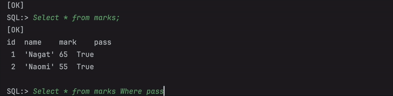
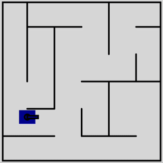
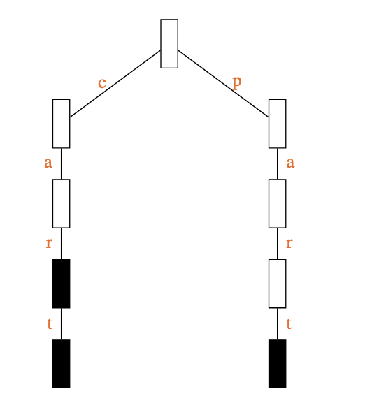

# My projects! 

Hi :wave: I am Nagat and welcome to this repository, in which, I will be introducing the most exciting projects I have worked on. Most of these projects I have completed as part of my MSc Computer Science (Conversion) at the University of Bristol. Others, I have been working on in my own time to get stuck into the technologies and tools I am most interested in! 

## 📑 Table of Contents

- [Dissertation "Assessing Correctness in LLM-Based Code Generation"](#individual-summer-project-and-dissertation-assessing-correctness-in-llm-based-code-generation)
- [Python Tensorflow Chatbot Framework](#building-a-contextual-chatbot-framework-using-tensorflow)
- [Java Relational Database](#built-a-relational-database-server-in-java-that-handles-sql-commands)
- [JavaScript Group Project (HEX WARS)](#group-project-used-software-engineering-principles-to-develop-and-deploy-a-p5js-game-hex-wars)
- [C Dictionary ADT (Trees and Linked List)](#implemented-a-dictionary-adt-abstract-data-type-in-c)


# Current projects 

Let's start with the most sizeable one:


## Individual Summer Project and Dissertation: "Assessing Correctness in LLM-Based Code Generation"

I have chosen to tackle this topic for my summer project because I am passionate about ensuring emerging technologies are safe and reliable. I believe that investigating the accuracy of LLMs will be a great foundation in understanding their current state before potentially looking into societal implications in future projects. 

### What I have done so far 

I have read many papers around the topic to understand how accuracy has been evaluated in the past:

| Paper                          | What I Found Interesting                            |
|------------------------------------|----------------------------------------------------|
| Assessing Correctness in LLM-Based Code Generation via Uncertainty Estimation (Sharma, David)  | Estimating uncertainty across semantically equivalent clusters makes estimating uncertainty more accurate
| Towards Translating Real-World Code with LLMs: A Study of Translating to Rust (Eniser et al.) | Temperature parameter is used by LLMs themselves to control randomness |
| Enhancing SQL Query Generation with Neurosymbolic Reasoning (Princis et al.) | Reading this paper led to me having an interesting discussion with my supervisor about whether positive research on neurosymbolic architecture will lead to its widespread adoption  |
| Detecting hallucinations in large language models using semantic entropy (Farquhar et al.) | The distinction of confabulations and their contribution to LLM inaccuracy |


### Next Steps

1. Learn how to extract LLM-reported log probabilities
2. Choose an evaluation technique

*Watch this space!* I will be working on this project until September 2025 so prepare for this summary to develop immensely :star_struck:


## Building a contextual chatbot framework using Tensorflow

I am not only interested in investigating how well these models work but also how they are built under the hood. That is why I have taken on the challenge of building a chatbot in my own time. I am also excited to put my python skills to the test.

### What I have done so far:

1. Intent definitions -> Tensorflow model
 - Created classes defining conversational intents (holding tags, patterns and responses)
 - Created classes of words within documents (learned about stemmed words and how they make up sentences)
 - Shuffled and split this training data to mitigate bias

2. Build chatbot framework
 - Used bag-of-words method to tokenise user input

### Next steps

Finish building, train and test the model 


# Past projects


## Built a relational database server in Java that handles SQL commands

[link to the code](Java-database-project/Project/src/main/java/edu/uob)

### What it does: 
- Takes SQL commands (according to a specific BNF) and stores the resulting tables/databases in a tree (creates database directories and table files as needed)
- Changes the data in the tree depending on the command
- Responds based on updated table data

The below shows the server in action:



It also demonstrates the challenge of ensuring all commands were handled as case-insensitive

### Main challenge: 
Making sure files and data in tree both updated correctly, specifically for more challenging commands e.g. update

The below function was useful in finding the index of the child (element within a table) to update it cleanly

```
    public int getChildNumber(DBTreeNode parent, DBTreeNode child){
        for(int i = 0 ; i < next.size() ; i++) {
            if (parent.next.get(i) == child) {
                return parent.next.indexOf(child);
            }
        }
        return 0;
    }
```

I wrote the below function in order to traverse through the tree deleting all children after receiving a 'DELETE' command
```
    public void deleteAllChildren(DBTreeNode root){
        if(root == null){
            return;
        }
        for(int i = 0 ; i < root.next.size() ; i++) {
            deleteAllChildren(root.next.get(i));
        }
        parent.next.remove(root);
    }
```


### What I learned: 
- How to program rather than just code (first time working towards deliberately ambiguous instructions - difficult but worth it! :tada:)
- It is important to be intentional about design and how classes will interact from the beginning 
- However, always be prepared to refactor significantly as you understand the objective more


## Group Project: Used Software Engineering principles to develop and deploy a P5js game (HEX WARS)

[Check out our group's repo](https://github.com/UoB-COMSM0166/2025-group-7)

[Play the game!](https://uob-comsm0166.github.io/2025-group-7/)

I did many things for the first time as part of this project. For example, working according to an Agile SDLC (taking part in sprints, reviews and retrospectives), practicing Extreme Programming, and using Git in practice. 

### Main personal challenge: Learn how to code in JavaScript and integrate code with other group members'

We decided as a team to develop our own individual implementations so we could all get to grips with JavaScript (which we were unfamiliar with).

Here is a demonstration of my own (very simple) prototype that helped me first start learning the language:





[link to the code for my prototype](Group-project-files/My-prototype)

### My main contributions: 
- End of round and game restart functionality
- Tank destroy animations
- Saw weapon design and functionality
- A bulk of report writing

### What we learned: 
- Focus on sustainability and accessibility from the very beginning
- Prioritise technical challenges earlier in the project


## Implemented a Dictionary ADT (Abstract Data Type) in C

[link to the code](C-ADT-project-files/C-project)



### What it does:
- Uses a 27-way Tree method to store words where each node (after the top one) corresponds to a letter.
- counts words and nodes
- compares lengths of words and autocompletes

The below function frees all the allocated data at the end of the program:

```
void dict_free(dict** p)
{
   if(*p == NULL){
      return;
   }
       
   for(int i = 0; i < ALPHA; i++){
      dict_free(&((*p)->dwn[i]));       
   }
   free(*p);
   *p = NULL;
}
```

### Main Challenge: Implementing the project again using a datatype of my choice (singly-linked list)

### What I learned:

> I learned that the 27-way tree approach is far more efficient than my implementation of the linked list. This is because the 27-way tree is only as deep as the amount of letters in the longest word in the dictionary. Conversely, the linked list is as long as the number of unique words in the dictionary.
> In future, I would favour the 27-way tree approach to this question over a singly-linked list. However, I would like to try hashing or a different kind of tree to find an overall more efficient approach than the 27-way tree.  


## License

This project is licensed under the [MIT License](LICENSE).


